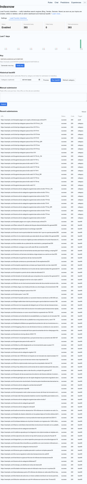

# Load Foundry IndexNow

A **Load Foundry** plugin for Discourse that notifies **IndexNow** search engines — **Bing, Yandex, Seznam and Naver** — the moment your topics are created, edited or deleted. Fresh content gets crawled (and removed content gets dropped) much faster than waiting for the next scheduled crawl.

## Features

- **Instant notifications** to IndexNow whenever a topic, post or edit changes a topic.
- **Handles removals**: when a topic is deleted, its URL is submitted so engines can drop it.
- **Only public content**: private messages and topics in restricted categories are never submitted.
- **Background job**: submissions run asynchronously (never block a request) and never break your forum if the API is down.
- **Zero configuration**: a key is generated automatically on first run and served at `/indexnow/<key>` for verification.
- **Admin dashboard** (Admin → Plugins → Load Foundry IndexNow): status, key file, verify/rotate the key, today's counts, a **last-7-days trend**, **failure reasons** and a recent-submissions log.
- **Historical backfill** with **preview**: see how many topics match (by category/date) before submitting.
- **Manual submission**: paste URLs (one per line) to submit specific links.
- **Batching + rate limits + Retry-After**: URLs are chunked into a single request; hourly/daily quotas are respected and `429` triggers a temporary throttle.
- **Exclusions**: skip categories and tags you don't want indexed.
- **Multilingual** admin UI (English / Español / Português).

## Screenshots



## How IndexNow works

1. The plugin hosts your **key** at `https://your-forum/<key>.txt` (also available at `/indexnow/<key>`).
2. When a topic changes, it `POST`s the topic URL to `https://api.indexnow.org/indexnow` with your host, key, `keyLocation` and `urlList`.
3. **Bing, Yandex, Seznam and Naver** are notified through the shared IndexNow endpoint.

## Installation

Add to your `containers/app.yml` (inside `hooks: after_code:`):

```yaml
hooks:
  after_code:
    - exec:
        cd: $home/plugins
        cmd:
          - git clone https://github.com/LoadFoundryHQ/discourse-indexnow.git
```

Then rebuild:

```bash
cd /var/discourse
./launcher rebuild app
```

## Configuration

Admin → Settings → Plugins → **Load Foundry IndexNow**:

| Setting | Default | Description |
|---|---|---|
| `indexnow_enabled` | `true` | Enable/disable the plugin. |
| `indexnow_key` | *(auto)* | IndexNow key, served at `/<key>.txt`. Auto-generated if empty. |
| `indexnow_endpoint` | `https://api.indexnow.org/indexnow` | IndexNow API endpoint. |
| `indexnow_submit_on_create` | `true` | Submit when a topic/post is created. |
| `indexnow_submit_on_update` | `true` | Submit when a post is edited or a topic is deleted. |
| `indexnow_submit_on_reply` | `false` | Submit when a new reply is posted. |
| `indexnow_excluded_category_ids` | *(empty)* | Categories to exclude. |
| `indexnow_excluded_tag_names` | *(empty)* | Tags to exclude. |
| `indexnow_hourly_limit` | `200` | Max URLs per hour. |
| `indexnow_daily_limit` | `10000` | Max URLs per day. |

## Verifying

Visit `https://your-forum/<your-key>.txt` — it should return your key as plain text. IndexNow uses this to confirm you own the domain.

## Notes

- Submissions are **best-effort**: if the IndexNow API is unreachable, the forum keeps working (errors are logged, never raised).
- IndexNow is a shared protocol; individual engines may still take a little time to reflect changes, but far less than a normal crawl.

## License

MIT — see [LICENSE](LICENSE). © Load Foundry.
